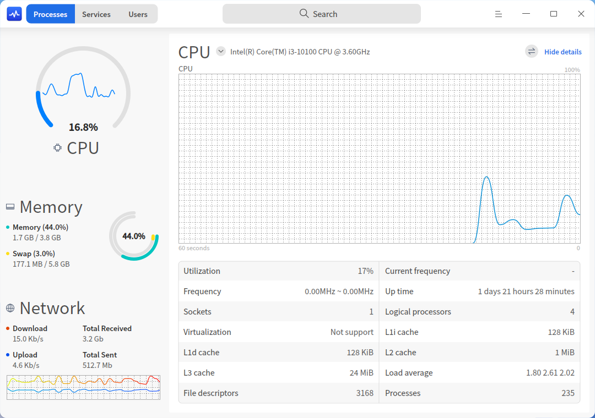
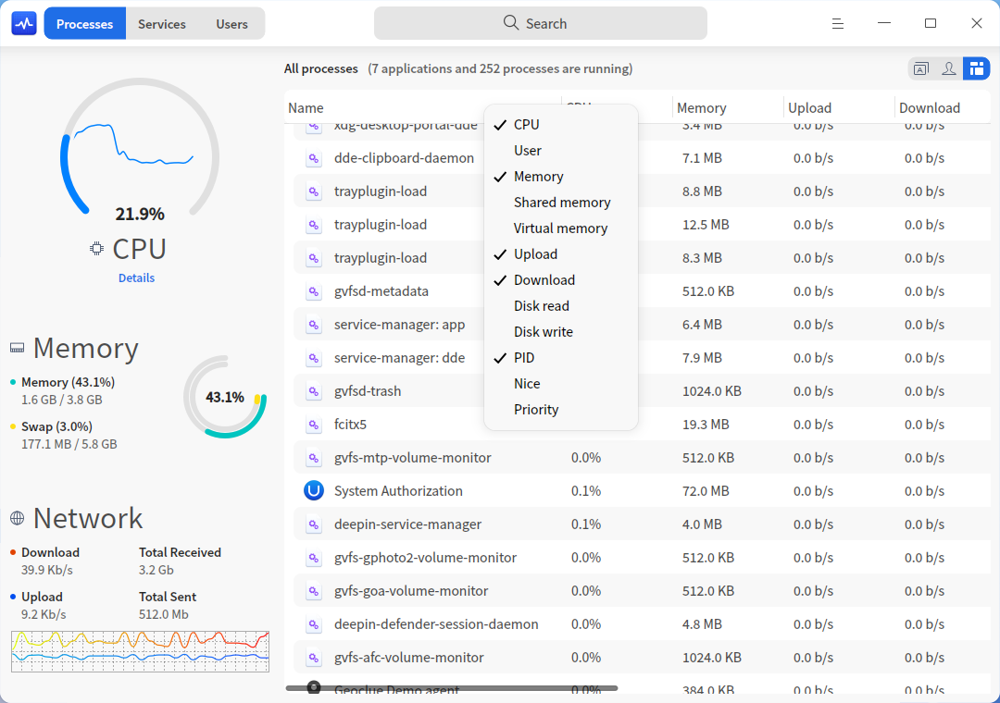
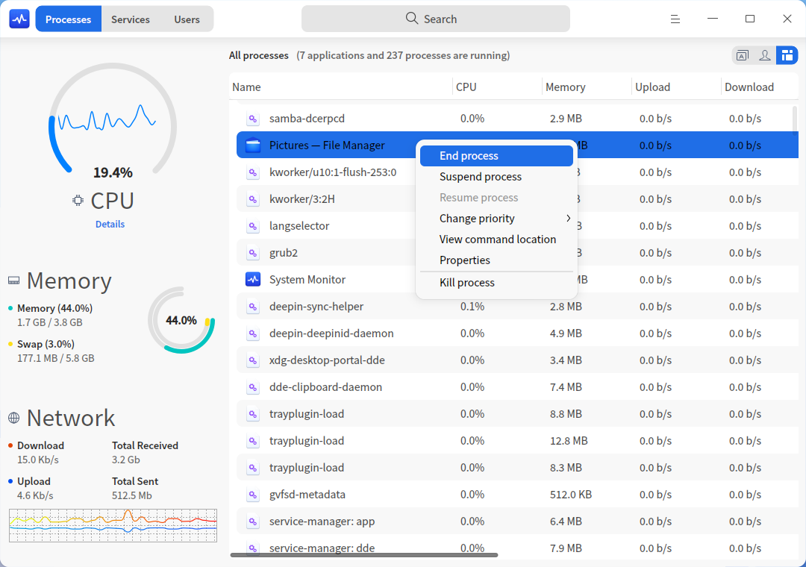
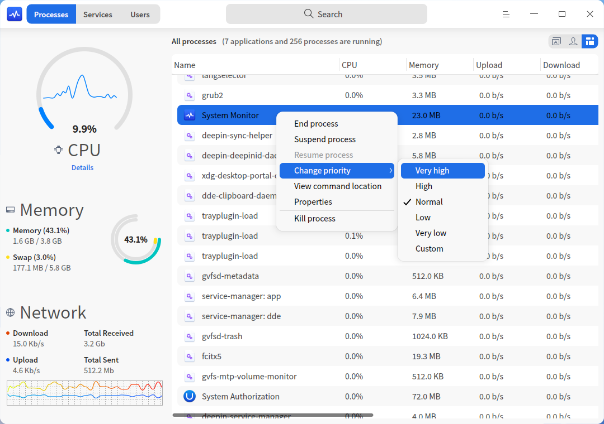
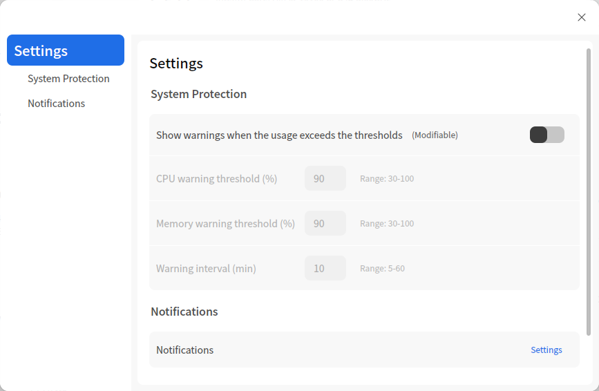

# System Monitor|deepin-system-monitor|

## Overview

System Monitor is a system tool monitoring and managing hardware load, program running and system services. It supports real-time monitoring of CPU status, memory footprint, and upload/download speed, helps manage system and application process, and enables searching and force ending of processes.

## Basic Operations

### Search Process

1. Click  in the Search box.  
2. Enter keywords and the search results will be displayed automatically.

### Hardware Monitoring

Click > **View** in the System Monitor interface, select **Expand** or **Compact** and view the CPU, memory and network info of your system in **Expand** view or **Compact** view.

| Name    | Description                                                  |
| ------- | ------------------------------------------------------------ |
| CPU     | Display the running and loading status of your CPU over the recent period of time |
| Memory  | Display the total memory and swap and their current footprints |
| Network | Display the upload and download speed of the current network in real-time |
| Disk    | Display the reading and writing speed in the current disk which is only in "Compact" view |

#### View Hardware Info

You can view the detailed hardware info in one of the following ways:

- In the **Process** tab on the System Monitor interface, click the CPU, Memory, Network or Disk area on the left, the corresponding details will be displayed on the right.
- In the **Process** tab on the System Monitor interface, click the **Details** icon on the left and the detailed CPU info will be displayed on the right by default. Click the  icon besides CPU to expand the drop-down list and view the detailed info on memory, network or disk.
- Go to **Control Center > Personalization > Dock** and check **System Monitor** in the **Plugin Area** and the System Monitor icon  will be displayed in the Dock. Hover the mouse pointer over the icon, CPU, Memory and network upload and download info will be displayed. Click the icon to run System Monitor.

>  Notes: On the System Monitor interface, click **Details** and then click the  icon to view the individual or overall information of CPU. Click **Hide details** to compact the detailed info.

### Process Management

#### Switch Process Tabs

Click the top right tabs on the System Monitoring interface to view **Applications**, **My processes** and **All processes**.

- Click  to switch to **Applications**. 
- Click  to switch to **My processes**. 
- Click  to switch to **All processes**.

#### Adjust Process Order

You can adjust the process order by Name, CPU, User, Memory, Shared memory, Virtual memory, Upload, Download, Disk read, Disk write, PID, Nice and Priority.

- On the System Monitor interface, click the tabs in the top of the process list to sort the processes. Multiple clicks allow sorting from low to high or high to low.
- Right-click the top tabs to check the options you want to view or uncheck the options you want to hide.

#### End Process

System Monitor can be used to end processes.

1. On the System Monitor interface, right-click the process you want to end.
2. Select **End Process**.
3. Click **End** in the pop-up window to confirm.

>  Notes:  You can also right-click a process to select **Kill process** to end the process. This feature may cause data loss. Please proceed with caution.

#### End Application

1. Click  on the System Monitor interface..
2. Select **Force end application** ( available for graphical processes only).
3. Click the window of application you want to close according to the prompt.
4. Click **Force End** in the pop-up window to confirm.

>  Notes: Press **Esc** on the keyboard to terminate the operation above and return to the System Monitor interface.

#### Suspend/Resume Process

1. On the System Monitor interface, right-click the process you want to suspend.
2. Select **Suspend process**. The process will be tagged with **(Suspend)** and turned red in the list. 
3. Right-click it again and select **Resume process** to resume it.

#### Change Process Priority 

1. On the System Monitor interface, right-click a process.
2. Select **Change priority** and select a priority level.

> Notes: You can also select **Custom** to customize the priority level.

#### View Process Location

1. On the System Monitor interface, right-click the process you want to view.
2. Select **View command location** to open the location in File Manager. 

#### View Process Properties

1. On the System Monitor interface, right-click the process you want to view.
2. Select **Properties** to view the name, command line, and start time of the process.

### System Service Management

You can start, stop, restart, set startup type, and refresh system service processes.
In the list of system services, force-ending of application is prohibited.

> Attention: For better system operation, please don't end any system services processes and root processes.

#### Start System Service
1. Select the **Services** tab on the System Monitor interface.
2. Right-click a process that is not started yet and select **Start**. Enter the password if an authentication window pops up.
3. **active** is displayed in the **Start State** column.
4. Right-click the service and select **Startup type**. Select from **Auto** and **Manual** options.
5. Right-click the service and select **Refresh**.

#### Stop System Service

1. Select the **Services** tab on the System Monitor interface.
2. Right-click a process that is started already and select **Stop**. Enter the password if an authentication window pops up.
3. **inactive** is displayed in the **Start State** column.
4. Right-click the service and select **Refresh**.

You can also right-click a system process and select **Restart**. 

### User Management

On the "Users" tab, you can view the names and types of logged-in user accounts. After selecting an account, you can:
- Right-click and select **Edit account information** to modify the account info in the Accounts window of Control Center.
- View all processes under the account on the right, and right-click a process to end or suspend it, change its priority, etc.

## Main Menu

In the main menu, you can force ending applications, switch monitoring modes and themes, view help manual, and learn more information of System Monitor.
### View

System Monitor offers Expand view and Compact view for your choice.

1. Click  on the System Monitor interface.
2. Click **View** to select one mode.

>  Notes: Compact view and expand view are only available for processes.

### Settings
On the System Monitor interface, Click  > **Settings**  and you are able make relative settings on system protection and notifications.

- **System Protection**: Turned off by default. You are able to set a threshold for **CPU**,  **Memory**  and **Warning interval** respectively and there will be warnings displayed when the monitored values detected are higher than the thresholds.

- **Notifications**: Turned on by default. You are able to click **Settings** to turn on or off notifications in Control Center.

### Theme

There are three window themes, namely Light Theme, Dark Theme, and System Theme.

1. Click  on the System Monitor interface.
2. Click **Theme** to select one theme.

### Help

1. Click  on the System Monitor interface.
2. Click **Help** to view the manual of System Monitor.

### About

1.  Click  on the System Monitor interface.
2.  Click **About** to view the version and introduction of System Monitor.

### Exit

1. Click  on the System Monitor interface.
2. Click **Exit** to exit System Monitor.

