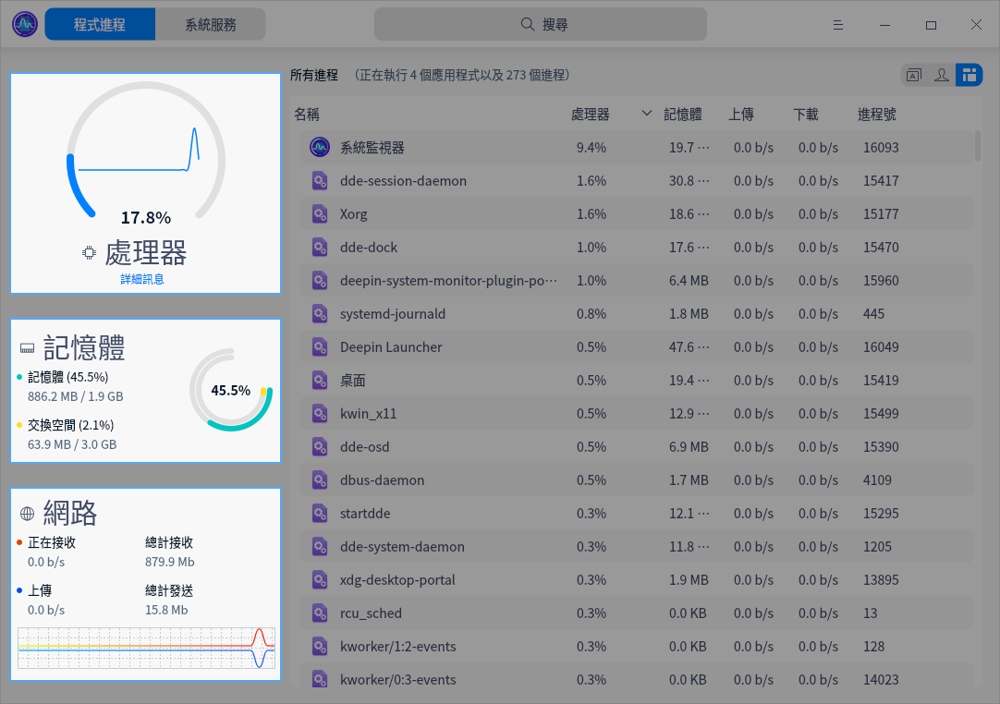
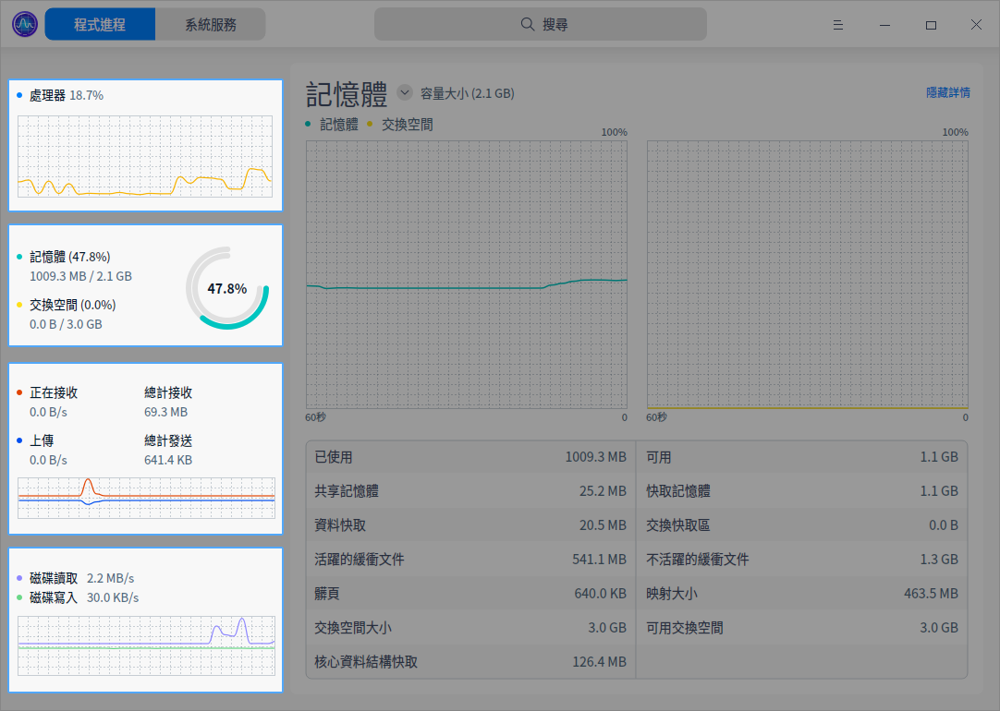
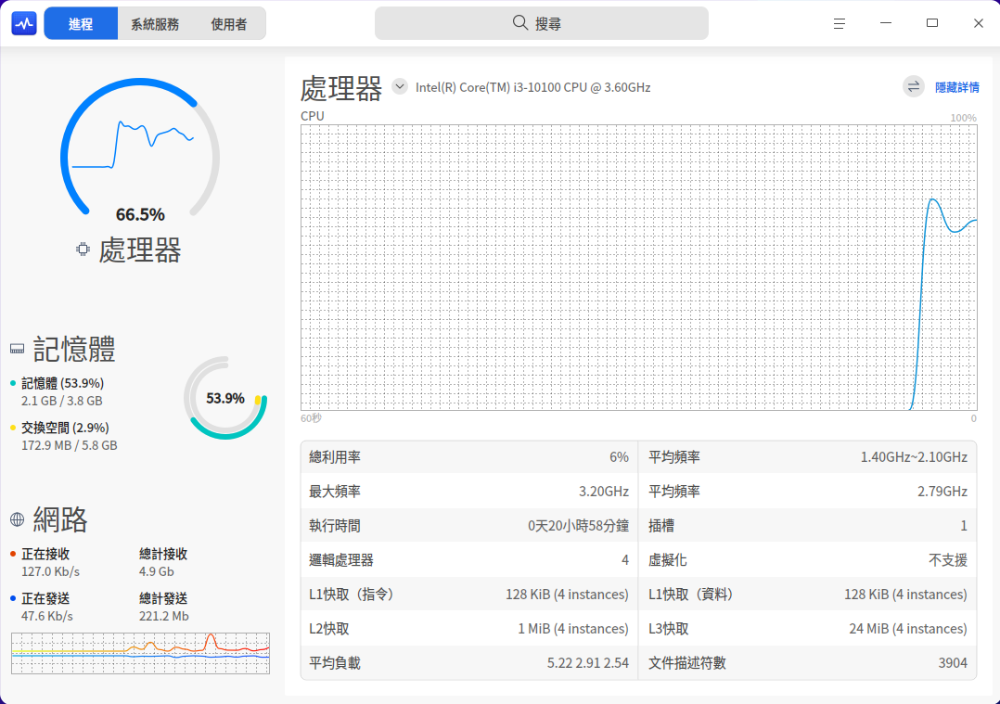
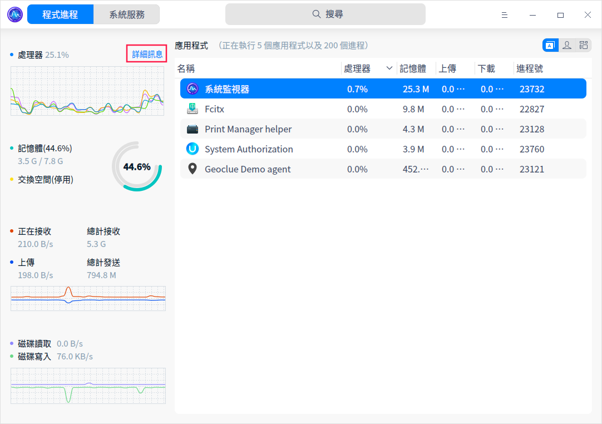
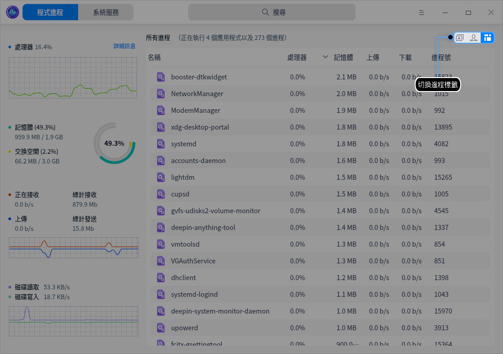
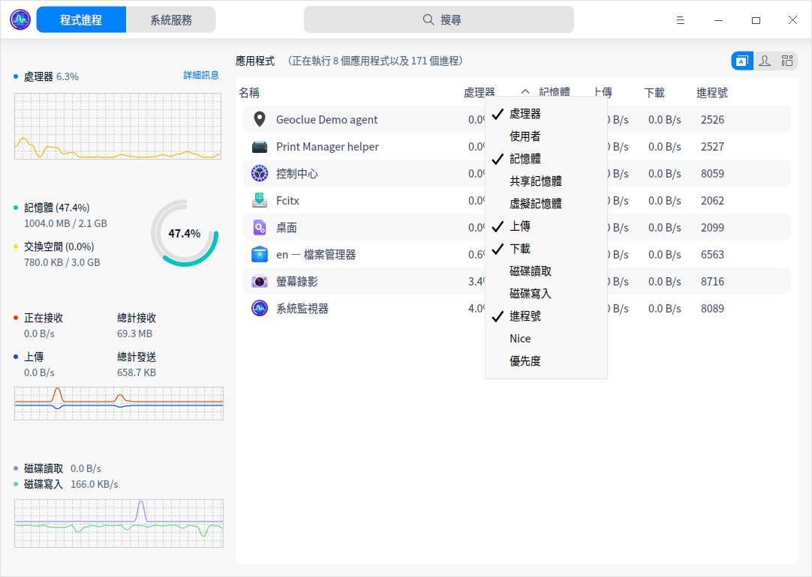
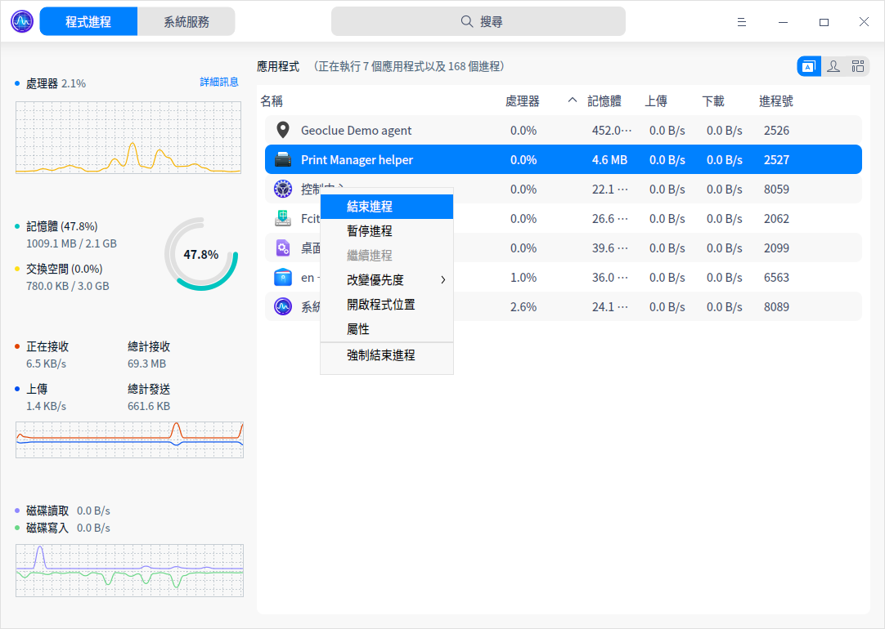
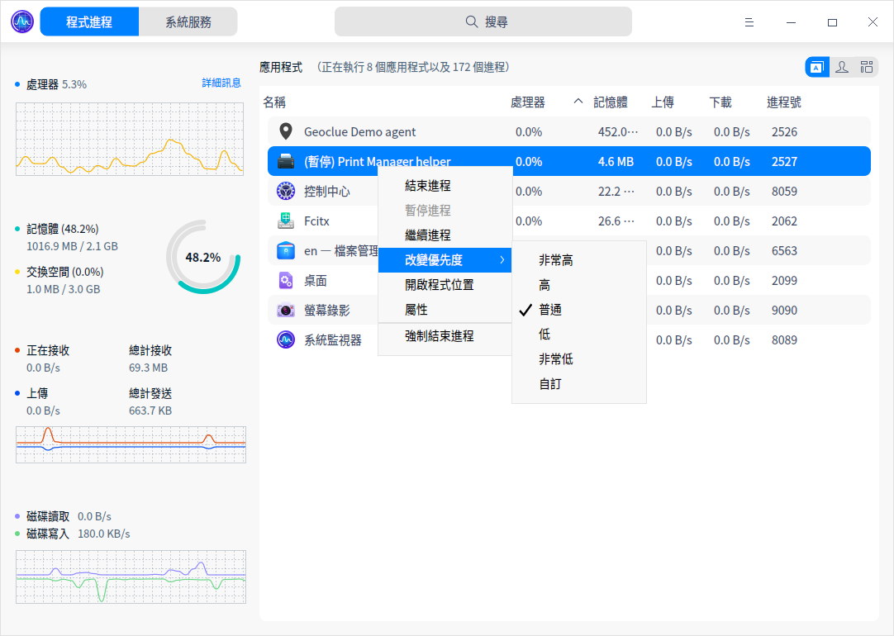

# 系統監視器|deepin-system-monitor|

## 概述

系統監視器是一個對硬體負載、程式執行和系統服務，進行監測查看和管理的系統工具。系統監視器可以即時監控處理器狀態、記憶體占用率、網路上傳下載速度、還可以管理系統進程和應用進程，也支援搜尋進程和強制結束進程。

## 操作介紹

### 搜尋進程

1. 在系統監視器搜尋框中單擊 。
2. 輸入關鍵字，即時展示搜尋結果。   

### 硬體監控

在系統監視器中，單擊  > **檢視** 選擇「舒展」或「簡潔」模式展示電腦的處理器、記憶體、網路和磁碟狀態。

| 名稱   | 說明                                                     |
| ------ | -------------------------------------------------------- |
| 處理器 | 顯示處理器最近一段時間的執行負載情況。                   |
| 記憶體 | 顯示記憶體總量和目前占用量，交換空間大小和目前占用量。   |
| 網路   | 即時顯示目前網路上傳下載速度。                           |
| 磁碟   | 僅在「簡潔」檢視下顯示；即時顯示目前磁碟讀取與寫入速度。 |

#### 查看硬體訊息

在舒展和簡潔模式下，可查看處理器、記憶體、網路和磁碟狀態的詳細訊息。

1. 在系統監視器介面上，單擊左側 **詳細訊息**，右側預設展開處理器的詳細訊息。
2. 單擊處理器旁邊的按鈕  展開下拉選單選項，可選擇查看記憶體、網路或磁碟的詳細訊息。
3. 單擊右側 **隱藏詳情** 收起詳情頁。

### 程式進程管理

#### 切換進程標籤

您可以單擊介面右上角的圖示切換進程標籤，分別可以查看應用程式、我的進程和所有進程。

- 單擊圖示  切換到 **應用程式** 頁面。
- 單擊圖示  切換到 **我的進程** 頁面。
- 單擊圖示  切換到 **所有進程** 頁面。

#### 調整程式排序

程式列表可以根據名稱、處理器、使用者、記憶體、共享記憶體、虛擬記憶體、上傳、下載、磁碟讀取、磁碟寫入、進程號、Nice、優先度等進行排列。

- 在系統監視器介面單擊程式列表頂部的標籤，程式會按照對應的標籤排序，多次單擊可以切換升序和降序。
- 在系統監視器介面右鍵單擊程式列表頂部的標籤欄，可以取消勾選標籤隱藏對應的標籤列，再次勾選可以復原顯示。

#### 結束進程
您可以使用系統監視器結束系統和應用程式。
1. 在系統監視器介面上，右鍵單擊需要結束的進程。
2. 選擇 **結束進程**。
3. 在彈出視窗單擊 **結束進程**，確認結束該進程。

>說明：您也可以在右鍵選單中選擇 **強制結束進程**，強制結束進程可能會導致資料遺失，請謹慎操作。

#### 結束圖形化應用程式

您可以使用系統監視器來關閉桌面上圖形化的進程。

1. 在系統監視器介面上，單擊 。
2. 選擇 **強制結束進程**。   
3. 根據螢幕提示在桌面上單擊想要關閉的應用視窗。
4. 在彈出的對話框中單擊 **強制結束**，來確認結束該應用。

>說明：若要中止上述操作，可按下鍵盤上 **Esc** 鍵返回至系統監視器介面。

#### 暫停和繼續進程

您可以使用系統監視器暫停和繼續進程。

1. 在系統監視器介面上，右鍵單擊一個進程。
2. 選擇 **暫停進程**，被暫停的進程會帶有暫停標籤。
3. 再次右鍵單擊被暫停的進程，選擇 **繼續進程** 可以繼續該進程。

#### 改變進程優先度

1. 在系統監視器介面上，右鍵單擊一個進程。
2. 選擇 **改變優先度** 來進行設定。您還可以自訂程式的優先度。

#### 查看進程路徑

1. 在系統監視器介面上，右鍵單擊一個進程。
2. 選擇 **開啟程式位置**，打開該進程所在的資料夾位置。。

#### 查看進程屬性

1. 在系統監視器介面上，右鍵單擊一個進程。
2. 選擇 **屬性**，可以查看進程的名稱、命令列、啟動時間。

### 系統服務管理

您可以啟動、停止、重新啟動、設定啟動方式、重新整理系統服務進程。
在系統服務列表，禁止強制結束應用程式。

>注意：為系統更好的執行，請勿結束系統服務自身的進程以及根進程。

#### 啟動系統服務

1. 在系統監視器介面上，選擇 **系統服務** 頁簽。
2. 選中某個未啟動的系統進程，右鍵單擊 **啟動**。
3. 彈出授權對話框，請輸入密碼授權。該系統服務的「活動」會置為「已啟動」。
4. 右鍵單擊已選中的系統進程，選擇 **設定啟動方式**，將啟動方式設定為自動或者手動。
5. 右鍵單擊 **重新整理**，重新整理服務列表。

#### 停止系統服務

1. 在系統監視器介面上，選擇 **系統服務** 頁簽。
2. 選中某個已啟動的系統進程，右鍵單擊 **停止**。
3. 彈出授權對話框，請輸入密碼授權。該系統服務的「活動」會置為「未啟動」。
4. 右鍵單擊 **重新整理**，重新整理服務列表。

您也可以右鍵單擊 **重新啟動**，重新啟動系統服務。

## 主選單

在主選單中，您可以切換監控模式、切換視窗主題、查看說明手冊、了解系統監視器的更多訊息。

### 主題

視窗主題包含亮色主題、暗色主題和系統主題。

1. 在系統監視器介面，單擊 。
2. 單擊 **主題**，選擇一個主題顏色。

### 檢視

系統監視器提供了舒展模式和簡潔模式，您可以根據需要選擇展現監控訊息的模式。

1. 在系統監視器介面，單擊 。
2. 單擊 **檢視**，選擇一種檢視模式。

>說明：舒展模式和簡潔模式僅在程式進程頁簽中展示。

### 說明

查看說明手冊，進一步了解和使用系統監視器。

1. 在系統監視器介面，單擊 。
2. 單擊 **說明**。
3. 查看系統監視器的說明手冊。

### 關於

1. 在系統監視器介面，單擊 。
2. 單擊 **關於**。
3. 查看關於系統監視器的版本和介紹。

### 離開

1. 在系統監視器介面，單擊 。
2. 單擊 **離開**。

