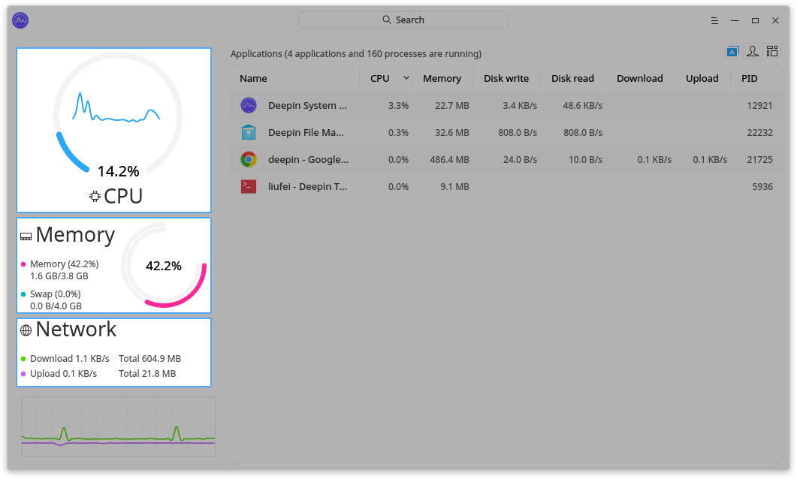
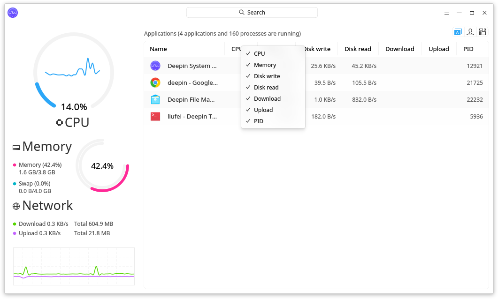
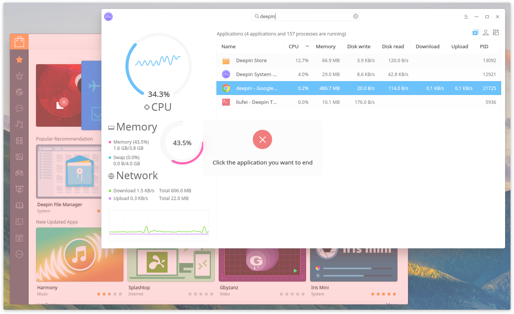
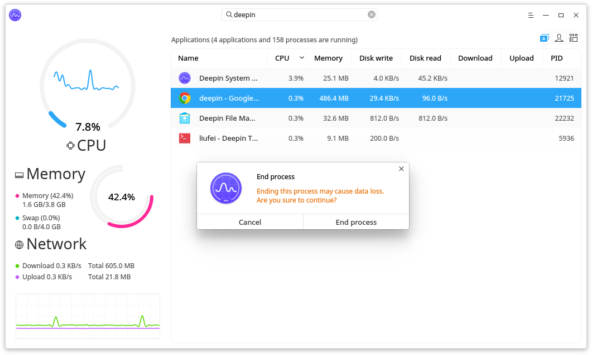
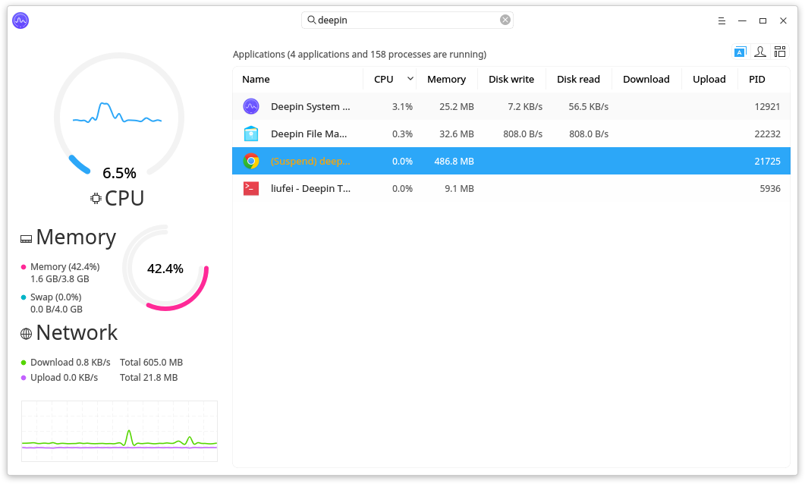
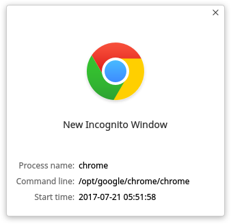
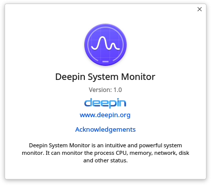

# Deepin System Monitor |../common/monitor.svg|

## Overview|../common/icon_overview.svg|

Deepin System Monitor is an intuitive and powerful system monitor. It can monitor the process CPU, memory, network, disk and other status. You can also search, suspend, resume and end your processes by it.

## Basic Operations|../common/icon_basicfuncton.svg|

### Status Monitoring

Deepin System Monitor can monitor the CPU, memory and network status of your system:

- CPU monitoring, you can view the CPU usage and usage trends through graphics, number and curve.
- Memory monitoring, you can view the memory size and real-time usage, total swap space and real-time usage.
- Network monitoring, you can view the download and upload speed,total download and upload size as well as the network status trend.

### Process Management

#### Switch Process Tabs

Click on the top right tabs on interface to switch to view application processes, user's processes and all processes.

- Click on  to view the application processes.
- Click on  to view the user's processes.
- Click on  to view all processes.

#### Adjust Process Order

You can adjust the process order by name, CPU, memory, disk write, disk read, download, upload and PID.

1. On Deepin System Monitor interface, click on the top tabs of process list to sort the processes.
2. Multiple clicks to sort from low to high or high to low.
3. Right click on the top tabs to check or uncheck.

#### Search Process

Type the process name in the top search box on Deepin System Monitor interface to search and quickly locate the process.

#### Force to End Process

1. On Deepin System Monitor interface, click the main menu.
2. Select **Force to end application**.
3. Click on the opened application window to end when the mouse becomes .
4. Click on **End application** in the pop-up window to confirm.

> : You can only end GUI application process by clicking on **Force to end application**.

#### End Process

1. On Deepin System Monitor interface, right click on the process you want to end.
2. Select **End process**.
3. Click on **End process** in the pop-up window to confirm.

> : You can select **End process** to end all processes.

#### Suspend/Continue Process

1. On Deepin System Monitor interface, right click on the process you want to suspend.
2. Select **Suspend process**.
3. The process will be suspended, and you can right click to select **Resume process** to resume it.

#### View Process Location

1. On Deepin System Monitor interface, right click on the process you want to view.
2. Select **View process location**.
3. The process command location will be opened.

#### View Process Properties

1. On Deepin System Monitor interface, right click on the process you want to view.
2. Select **Properties**.
3. You can view the process name, command line and start time.

## Main Menu|../common/icon_optionsetting.svg|

### Switch Theme

You can switch the theme of Deepin System Monitor.

1. On Deepin System Monitor interface, click on  .
2. Click on **Dark theme**.
3. Switch to dark theme from the default light theme.

### Help

You can click to view the manual, which will help you further know and use Deepin System Monitor.

1. On Deepin System Monitor interface, click on  .
2. Click on **Help**.
3. View the manual.

### About

You can click to view the version description.

1. On Deepin System Monitor interface, click on .
2. Click on **About**.
3. View the version description.

### Exit

You can click to exit Deepin System Monitor.

1. On Deepin System Monitor interface, click on .
2. Click on **Exit** to exit.
